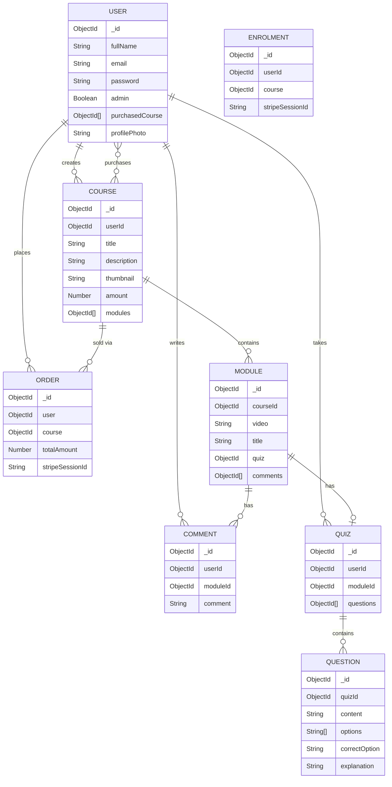

# 📚 Edemy — E-Learning Platform

A full-stack e-learning platform built with the **MERN stack** that allows administrators to create and manage courses with video modules, and enables students to browse, purchase, and learn from courses — with **AI-powered search** and **AI-generated quizzes** powered by Google Gemini.

---

## 📑 Table of Contents

- [Features](#-features)
- [Tech Stack](#-tech-stack)
- [Architecture](#-architecture)
- [Project Structure](#-project-structure)
- [Database Models](#-database-models)
- [API Endpoints](#-api-endpoints)
- [Workflow](#-workflow)
- [Setup & Installation](#-setup--installation)
- [Environment Variables](#-environment-variables)
- [Running the Application](#-running-the-application)
- [Screenshots](#-screenshots)

---

## ✨ Features

### 🎓 Student Features
| Feature | Description |
|---------|-------------|
| **User Registration & Login** | Secure authentication with bcrypt password hashing and JWT tokens |
| **Browse Courses** | View all available courses with thumbnails, descriptions, and pricing |
| **AI-Powered Search** | Intelligent course search using Google Gemini to understand natural language queries and match them with relevant categories |
| **Course Purchase** | Seamless payment integration with Stripe checkout sessions |
| **Video Learning** | Watch course video modules (hosted on Cloudinary) with a structured module-by-module flow |
| **AI-Generated Quizzes** | Auto-generate 10 multiple-choice quiz questions per module using Gemini AI, with explanations |
| **Comments** | Leave comments on individual course modules and view community discussions |
| **Profile Management** | Update name and profile photo (uploaded to Cloudinary) |
| **My Courses** | View all purchased courses in a dedicated dashboard |

### 🛡️ Admin Features
| Feature | Description |
|---------|-------------|
| **Admin Dashboard** | Dedicated admin panel with sidebar navigation |
| **Course Management** | Create new courses with title, description, pricing, and thumbnail upload |
| **Module Management** | Add video modules (MP4/MOV/AVI up to 500MB) to any course via Cloudinary |
| **Analytics Dashboard** | View total users, courses, enrollments, and revenue at a glance |
| **Daily Analytics** | Chart-based visualization of daily enrollments and revenue over a custom date range using Recharts |

### 🔐 Security & Auth
- **JWT-based authentication** with HTTP-only secure cookies
- **Role-based access control** — Admin routes are protected by email-based admin verification
- **Protected routes** on both frontend (React) and backend (Express middleware)
- **Password hashing** with bcrypt (10 salt rounds)

---

## 🛠 Tech Stack

### Frontend
| Technology | Purpose |
|------------|---------|
| **React 19** | UI library for building the single-page application |
| **Vite 7** | Lightning-fast build tool and dev server |
| **React Router DOM 7** | Client-side routing with protected route wrappers |
| **TanStack React Query 5** | Server state management, caching, and data fetching |
| **Zustand 5** | Lightweight client-side state management (user & module stores) |
| **Axios** | HTTP client for API requests |
| **Tailwind CSS 4** | Utility-first CSS framework for responsive styling |
| **Radix UI** | Accessible, unstyled UI primitives (Dialog, Popover, Avatar, Accordion) |
| **Lucide React** | Modern icon library |
| **Recharts 3** | Charting library for analytics dashboard |
| **React Hook Form 7** | Performant form handling with validation |
| **Sonner** | Toast notification system |
| **React YouTube** | YouTube video player component |
| **Quill** | Rich text editor |
| **rc-progress** | Progress bar component |
| **react-simple-star-rating** | Star rating component |
| **humanize-duration** | Human-readable time formatting |

### Backend
| Technology | Purpose |
|------------|---------|
| **Node.js** | JavaScript runtime |
| **Express 5** | Web framework for RESTful API |
| **Mongoose 9** | MongoDB ODM for data modeling and queries |
| **JWT (jsonwebtoken)** | Stateless authentication via signed tokens |
| **bcryptjs** | Password hashing and comparison |
| **Cloudinary** | Cloud-based image and video storage/CDN |
| **Multer** | Multipart form-data handling for file uploads |
| **multer-storage-cloudinary** | Direct video upload to Cloudinary via Multer |
| **Stripe** | Payment processing (checkout sessions, webhooks) |
| **Google Generative AI (Gemini 2.5 Flash)** | AI-powered search categorization and quiz generation |
| **cookie-parser** | Parse HTTP cookies for auth token extraction |
| **CORS** | Cross-origin resource sharing configuration |
| **dotenv** | Environment variable management |
| **Nodemon** | Hot-reload during development |

### Database
| Technology | Purpose |
|------------|---------|
| **MongoDB** | NoSQL document database |
| **Mongoose** | Schema-based modeling with relationships via ObjectId references |

### Third-Party Services
| Service | Purpose |
|---------|---------|
| **Cloudinary** | Image hosting (thumbnails, profile photos) & video hosting (course modules) |
| **Stripe** | Secure payment processing with checkout sessions |
| **Google Gemini AI** | Natural language search + automatic quiz generation |

---

## 🏗 Architecture

```
┌─────────────────────────────────────────────────────────────────┐
│                        CLIENT (React + Vite)                    │
│  ┌──────────┐  ┌──────────┐  ┌──────────┐  ┌───────────────┐   │
│  │  Pages   │  │Components│  │  Hooks   │  │ State (Zustand)│  │
│  │ (auth,   │  │ (Navbar, │  │(React    │  │ (user.store,  │   │
│  │  user,   │  │  UI,     │  │ Query)   │  │  module.store)│   │
│  │  admin)  │  │  Course) │  │          │  │               │   │
│  └────┬─────┘  └──────────┘  └────┬─────┘  └───────────────┘   │
│       │                           │                              │
│       └───────────┬───────────────┘                              │
│                   │ Axios (HTTP)                                  │
│              ┌────▼─────┐                                        │
│              │ API Layer│  (course.api, user.api, quiz.api, ...) │
│              └────┬─────┘                                        │
└───────────────────┼──────────────────────────────────────────────┘
                    │ REST API (JSON)
┌───────────────────┼──────────────────────────────────────────────┐
│                   │       SERVER (Express.js)                    │
│              ┌────▼─────┐                                        │
│              │  Routes  │  (user, course, module, quiz, ...)     │
│              └────┬─────┘                                        │
│                   │                                              │
│          ┌────────▼────────┐                                     │
│          │   Middleware    │  (auth, admin, multer upload)        │
│          └────────┬────────┘                                     │
│                   │                                              │
│          ┌────────▼────────┐                                     │
│          │  Controllers   │  (business logic)                    │
│          └────────┬────────┘                                     │
│                   │                                              │
│     ┌─────────────┼─────────────────┐                            │
│     │             │                 │                             │
│ ┌───▼───┐   ┌────▼─────┐   ┌──────▼──────┐                     │
│ │MongoDB│   │Cloudinary│   │Stripe / AI  │                      │
│ │(Data) │   │(Media)   │   │(Pay/Gemini) │                      │
│ └───────┘   └──────────┘   └─────────────┘                      │
└──────────────────────────────────────────────────────────────────┘
```

---

## 📂 Project Structure

```
e-learning_platform/
├── client/                          # React Frontend
│   ├── public/                      # Static assets
│   ├── src/
│   │   ├── api/                     # API service layer (Axios calls)
│   │   │   ├── analytic.api.js      # Analytics API calls
│   │   │   ├── comment.api.js       # Comment API calls
│   │   │   ├── course.api.js        # Course CRUD API calls
│   │   │   ├── module.api.js        # Module API calls
│   │   │   ├── purchase.api.js      # Payment/purchase API calls
│   │   │   ├── quiz.api.js          # Quiz API calls
│   │   │   └── user.api.js          # User auth & profile API calls
│   │   ├── components/              # Reusable components
│   │   │   ├── ui/                  # shadcn/Radix UI primitives
│   │   │   │   ├── accordion.jsx
│   │   │   │   ├── avatar.jsx
│   │   │   │   ├── button.jsx
│   │   │   │   ├── dialog.jsx
│   │   │   │   ├── popover.jsx
│   │   │   │   ├── sonner.jsx
│   │   │   │   └── spinner.jsx
│   │   │   ├── CourseSection.jsx     # Course card grid
│   │   │   ├── DashboardSidebar.jsx  # Admin sidebar navigation
│   │   │   ├── Navbar.jsx           # Top navigation bar
│   │   │   └── SearchResult.jsx     # Search results display
│   │   ├── hooks/                   # React Query custom hooks
│   │   │   ├── analytic.hook.js     # useAnalytics, useDailyAnalytics
│   │   │   ├── comment.hook.js      # useCreateComment, useGetComments
│   │   │   ├── course.hook.js       # useCourses, useSingleCourse, etc.
│   │   │   ├── module.hook.js       # useCreateModule, useGetModule
│   │   │   ├── payment.hook.js      # useCheckout, useVerifyPayment
│   │   │   ├── quiz.hook.js         # useGenerateQuiz, useGetQuiz
│   │   │   └── user.hook.js         # useLogin, useRegister, useProfile
│   │   ├── lib/                     # Utility functions
│   │   ├── pages/                   # Page components
│   │   │   ├── admin/               # Admin-only pages
│   │   │   │   ├── Cancel.jsx       # Payment cancellation page
│   │   │   │   ├── CreateModule.jsx # Add modules to a course
│   │   │   │   ├── Dashboard.jsx    # Admin dashboard layout
│   │   │   │   ├── DashboardAnalytics.jsx  # Analytics charts & stats
│   │   │   │   ├── DashboardProducts.jsx   # Course management (CRUD)
│   │   │   │   └── PaymentSuccess.jsx      # Payment confirmation
│   │   │   ├── auth/                # Authentication pages
│   │   │   │   ├── Login.jsx        # Login form
│   │   │   │   └── Register.jsx     # Registration form
│   │   │   └── user/                # Student pages
│   │   │       ├── Home.jsx         # Landing page with course listing
│   │   │       ├── Quiz.jsx         # AI-generated quiz interface
│   │   │       ├── SingleCourse.jsx # Course detail & purchase page
│   │   │       ├── SinglePurchasedCourse.jsx  # Video player & comments
│   │   │       └── YourCourse.jsx   # Purchased courses dashboard
│   │   ├── route/                   # Routing configuration
│   │   │   ├── MainRoute.jsx        # All application routes
│   │   │   └── ProtectedRoute.jsx   # Auth guard wrapper
│   │   ├── store/                   # Zustand state stores
│   │   │   ├── module.store.jsx     # Module state management
│   │   │   └── user.store.jsx       # User state management
│   │   ├── App.jsx                  # Root app component
│   │   ├── App.css                  # Global styles
│   │   ├── index.css                # Tailwind & base styles
│   │   └── main.jsx                 # React entry point
│   ├── components.json              # shadcn/ui configuration
│   ├── vite.config.js               # Vite configuration
│   ├── eslint.config.js             # ESLint configuration
│   └── package.json
│
├── server/                          # Express Backend
│   ├── src/
│   │   ├── config/                  # Configuration
│   │   │   ├── cloudinary.js        # Cloudinary SDK setup
│   │   │   ├── db.js                # MongoDB connection
│   │   │   ├── env.js               # Environment variables
│   │   │   └── stripe.js            # Stripe SDK setup
│   │   ├── controllers/             # Route handlers (business logic)
│   │   │   ├── analytics.controller.js  # Dashboard analytics & charts
│   │   │   ├── comment.controller.js    # Comment CRUD
│   │   │   ├── course.controller.js     # Course CRUD + AI search
│   │   │   ├── module.controller.js     # Module CRUD + comments
│   │   │   ├── payment.controller.js    # Stripe checkout + verification
│   │   │   ├── quiz.controller.js       # AI quiz generation + retrieval
│   │   │   └── user.controller.js       # Auth + profile management
│   │   ├── middleware/              # Express middleware
│   │   │   ├── auth.middleware.js   # JWT verification + admin check
│   │   │   ├── upload.js           # Multer memory storage (images)
│   │   │   └── videoUpload.js      # Multer + Cloudinary (video upload)
│   │   ├── models/                  # Mongoose schemas
│   │   │   ├── comment.model.js     # Comment schema
│   │   │   ├── course.model.js      # Course schema
│   │   │   ├── enrolment.model.js   # Enrolment schema
│   │   │   ├── module.model.js      # Module schema (video + quiz)
│   │   │   ├── order.model.js       # Order/payment schema
│   │   │   ├── question.model.js    # Quiz question schema
│   │   │   ├── quiz.model.js        # Quiz schema
│   │   │   └── user.model.js        # User schema
│   │   └── routes/                  # API route definitions
│   │       ├── analytic.route.js    # GET /api/analytic/*
│   │       ├── comment.route.js     # POST /api/comment/*
│   │       ├── course.route.js      # /api/course/*
│   │       ├── module.route.js      # /api/module/*
│   │       ├── payment.route.js     # /api/payment/*
│   │       ├── quiz.route.js        # /api/quiz/*
│   │       └── user.route.js        # /api/*
│   ├── index.js                     # Server entry point
│   ├── package.json
│   └── .env                         # Environment variables
│
├── .gitignore
└── README.md
```

---

## 🗄 Database Models

### Entity Relationship Diagram



---

## 🔌 API Endpoints

### Authentication & Users (`/api`)

| Method | Endpoint | Auth | Description |
|--------|----------|------|-------------|
| `POST` | `/api/register` | ❌ | Register a new user |
| `POST` | `/api/login` | ❌ | Login and receive JWT cookie |
| `POST` | `/api/logout` | ❌ | Clear auth cookie |
| `GET` | `/api/getUser` | ✅ | Get authenticated user profile |
| `POST` | `/api/updateProfile` | ✅ | Update name and/or profile photo |

### Courses (`/api/course`)

| Method | Endpoint | Auth | Admin | Description |
|--------|----------|------|-------|-------------|
| `POST` | `/api/course/createCourse` | ✅ | ✅ | Create a new course with thumbnail |
| `GET` | `/api/course/getCourse` | ✅ | ❌ | Get all courses (with optional AI search via `?search=`) |
| `GET` | `/api/course/getsingleCourse/:id` | ✅ | ❌ | Get a single course with populated modules |
| `GET` | `/api/course/purchaseCourse/:id` | ✅ | ❌ | Get a purchased course with modules |
| `GET` | `/api/course/getAllPurchasedCourse` | ✅ | ❌ | Get all courses purchased by the user |

### Modules (`/api/module`)

| Method | Endpoint | Auth | Description |
|--------|----------|------|-------------|
| `POST` | `/api/module/createModule` | ✅ | Create a module with video upload |
| `GET` | `/api/module/getModule/:id` | ✅ | Get a single module |
| `GET` | `/api/module/getComment/:id` | ✅ | Get all comments for a module |

### Quizzes (`/api/quiz`)

| Method | Endpoint | Auth | Description |
|--------|----------|------|-------------|
| `GET` | `/api/quiz/checkQuiz/:id` | ✅ | Check if user has a quiz for a module |
| `POST` | `/api/quiz/generateQuiz` | ✅ | Generate AI quiz for a module |
| `GET` | `/api/quiz/getQuiz/:id` | ✅ | Get quiz with all questions |

### Comments (`/api/comment`)

| Method | Endpoint | Auth | Description |
|--------|----------|------|-------------|
| `POST` | `/api/comment/createComment/:id` | ✅ | Add a comment to a module |

### Payments (`/api/payment`)

| Method | Endpoint | Auth | Description |
|--------|----------|------|-------------|
| `POST` | `/api/payment/checkout` | ✅ | Create Stripe checkout session |
| `POST` | `/api/payment/checkout/success` | ✅ | Verify payment and create order |

### Analytics (`/api/analytic`)

| Method | Endpoint | Auth | Admin | Description |
|--------|----------|------|-------|-------------|
| `GET` | `/api/analytic/getAnalyticData` | ✅ | ✅ | Get total users, courses, enrollments, revenue |
| `GET` | `/api/analytic/getDailyAnalyticData` | ✅ | ✅ | Get daily enrollment & revenue data for date range |

---

## 🔄 Workflow

### 1. User Registration & Authentication Flow

```
User → Register Page → POST /api/register
  → Validate input fields
  → Check if user already exists
  → Hash password with bcrypt (10 rounds)
  → Create user in MongoDB
  → Generate JWT token
  → Set HTTP-only secure cookie (24h expiry)
  → Redirect to Home
```

### 2. Course Creation Flow (Admin)

```
Admin → Dashboard → Create Course Form
  → Upload thumbnail image
  → POST /api/course/createCourse
    → Multer parses multipart form
    → Convert image to base64
    → Upload to Cloudinary (folder: "edemy")
    → Save course to MongoDB with Cloudinary URL
  → Course appears in course listing
```

### 3. Module Creation Flow (Admin)

```
Admin → Dashboard → Select Course → Add Module
  → Upload video file (MP4/MOV/AVI, up to 500MB)
  → POST /api/module/createModule
    → Multer + CloudinaryStorage handles upload
    → Video stored in Cloudinary (folder: "courseModule")
    → Module saved to MongoDB
    → Module ID pushed to Course.modules array
```

### 4. AI-Powered Course Search Flow

```
Student → Search Bar → Enter query (e.g., "I want to learn about web apps")
  → GET /api/course/getCourse?search=...
    → Send query to Gemini 2.5 Flash with prompt
    → AI extracts the most relevant category keyword
    → MongoDB regex search on title + description
    → Return matching courses
```

### 5. Course Purchase Flow

```
Student → Course Page → Click "Buy Now"
  → POST /api/payment/checkout
    → Check if already purchased
    → Create Stripe Checkout Session (INR currency)
    → Return Stripe session URL
  → Redirect to Stripe Checkout Page
  → Payment succeeds → Redirect to /purchase?session_id=...
  → POST /api/payment/checkout/success
    → Verify session with Stripe
    → Create Order in MongoDB
    → Push courseId to User.purchasedCourse
  → Student can now access the course
```

### 6. AI Quiz Generation Flow

```
Student → Purchased Course → Module Page → Click "Generate Quiz"
  → POST /api/quiz/generateQuiz
    → Check for existing quiz
    → Create empty Quiz document
    → Send module title to Gemini AI with structured prompt
    → AI returns 10 MCQ questions in JSON format
    → Parse and create Question documents
    → Link questions to Quiz, Quiz to Module
  → Student takes the quiz with instant feedback
```

### 7. Comment Flow

```
Student → Purchased Course → Module Page → Comment Section
  → POST /api/comment/createComment/:moduleId
    → Create Comment document
    → Push comment ID to Module.comments
    → Return populated comment with user info
  → Comment appears in real-time
```

---

## ⚙️ Setup & Installation

### Prerequisites

- **Node.js** v18+ 
- **MongoDB** (local or MongoDB Atlas)
- **Cloudinary** account → [cloudinary.com](https://cloudinary.com)
- **Stripe** account → [stripe.com](https://stripe.com)
- **Google AI Studio** API key → [aistudio.google.com](https://aistudio.google.com)

### 1. Clone the Repository

```bash
git clone https://github.com/Himansh101/E-learning-platform.git
cd e-learning_platform
```

### 2. Install Server Dependencies

```bash
cd server
npm install
```

### 3. Install Client Dependencies

```bash
cd ../client
npm install
```

---

## 🔑 Environment Variables

### Server (`server/.env`)

```env
# MongoDB
MONGO_URI=mongodb+srv://<username>:<password>@cluster.mongodb.net/edusmart

# Server
PORT=3000

# Authentication
JWT_SECRET=your_jwt_secret_key
ADMIN=admin@example.com

# Cloudinary
CLOUD_NAME=your_cloudinary_cloud_name
CLOUD_API_KEY=your_cloudinary_api_key
CLOUD_API_SECRET=your_cloudinary_api_secret

# Google Gemini AI
GEMINI_API_KEY=your_gemini_api_key

# Stripe
STRIPE_PUBLISHABLE_KEY=pk_test_...
STRIPE_SECRET_KEY=sk_test_...

# Client URL (for CORS & Stripe redirects)
CLIENT_URL=http://localhost:5173
```

### Client (`client/.env`)

```env
VITE_BACKEND_URL=http://localhost:3000
```

---

## 🚀 Running the Application

### Development Mode

**Terminal 1 — Start the Backend Server:**
```bash
cd server
npm run dev
```
> Server starts on `http://localhost:3000` with Nodemon hot-reload

**Terminal 2 — Start the Frontend Client:**
```bash
cd client
npm run dev
```
> Client starts on `http://localhost:5173` with Vite HMR

### Production Build

```bash
cd client
npm run build
npm run preview
```

---

## 🧪 Key Technical Decisions

| Decision | Rationale |
|----------|-----------|
| **Zustand over Redux** | Minimal boilerplate for simple user/module state management |
| **React Query over useEffect** | Automatic caching, refetching, and loading/error states for server data |
| **Cloudinary for media** | Handles both image and video (up to 500MB) with CDN delivery and transformations |
| **JWT in HTTP-only cookies** | Prevents XSS attacks; cookies automatically sent with requests |
| **Gemini 2.5 Flash** | Fast, cost-effective AI model for both search categorization and quiz generation |
| **Stripe Checkout Sessions** | PCI-compliant payment with hosted checkout page — no card data touches the server |
| **Express 5** | Latest Express with improved async error handling |
| **Multer memory storage (images)** | Convert to base64 and upload to Cloudinary without temp files |
| **Multer Cloudinary storage (video)** | Stream large video files directly to Cloudinary |

---

## 📄 License

This project is licensed under the ISC License.

---

## 👤 Author

**Himanshu**  
Cybercom Creation Internship  
🔗 [Internship Daily Tasks Repo](https://github.com/Himansh101/cybercom-internship)
